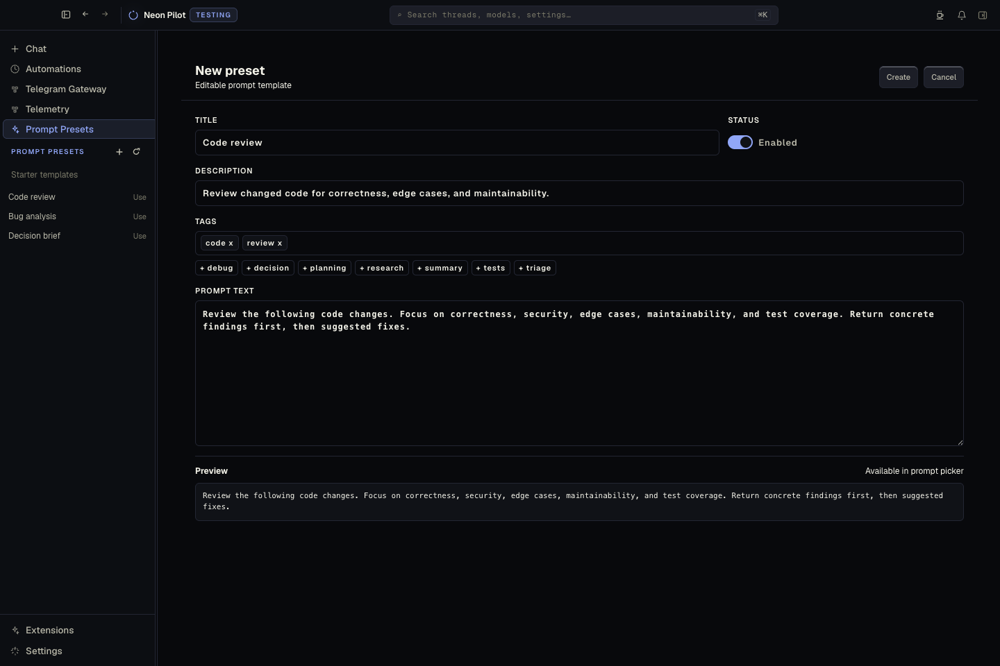
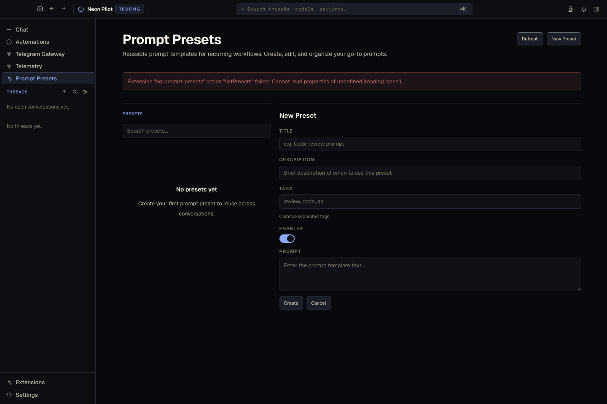

# Sidebar Examples

Use these examples when judging or generating extension-owned left sidebar views.

## Do

- Use the host sidebar through `views[].location: "sidebar"` and `contributes.nav[].sidebarView`.
- Use `SidebarSection` with `actionItems` for the uppercase title and compact icon actions.
- Use `SidebarList` for saved flat records and `SidebarTemplateList` for starter/example rows.
- Keep rows compact and title-first. Use `meta` only for state or compact operational metadata.
- Keep the main route as the editor/detail surface.

## Don't

- Do not build a second left rail inside the main page.
- Do not use local search/filter tabs until there is enough real data and workflow demand.
- Do not use row descriptions, card/list panel chrome, or oversized starter sections in the sidebar.
- Do not make CRUD creation a full-page form when selection-driven edit/detail can stay spatially stable.
- Do not hand-roll nested rows; use `SidebarTreeSection` for hierarchical Pierre-backed tree data.
